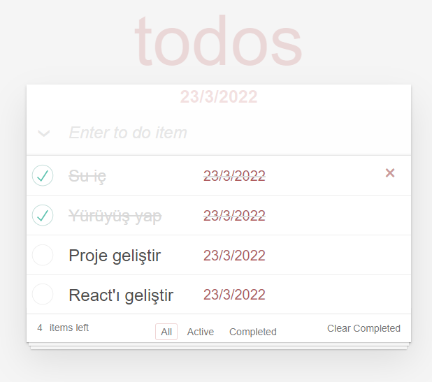

# Todos
## Patika.dev React modülü "todos project" çalışması.

weblink: https://reyhanyilmaz-todos.netlify.app/

### Proje özellikleri
1. Yeni bir todo ekleyebilme
2. Todoları tek tek silebilme, "checked" yapılabilme istenirse checkedları 2.click ile active yapabilme
3. "Active" , "completed" a göre filtreleme yapabilme
4. Tüm todoları "All completed" yapılabilme, input'a giriş yapılmadığında invisible olarak görünmektedir.
5. Completed olan todoları "clear completed" ile silinebilir, completed olan öğe yoksa buton invisible görünmektedir.
6. Filtrelemeye göre todo sayısı "item left" olarak ekranda görünmektedir. 
7. Local storage'a girilen todoları kayıt etme, silindiğinde local storagedan da silibilme 
8. Güncel tarihin ekranda görünmesi gibi özellikler çalışmaktadır.

